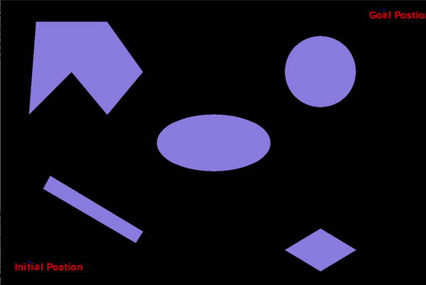
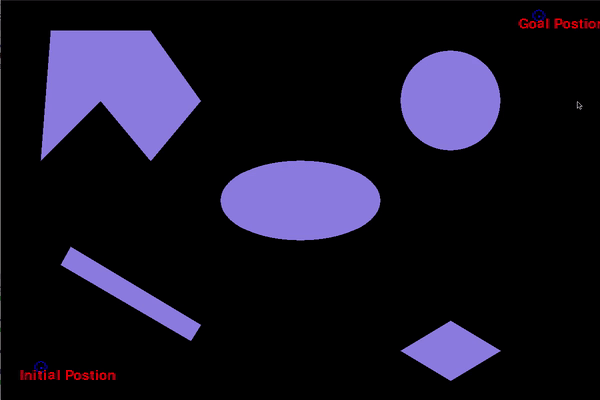
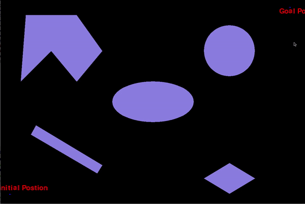
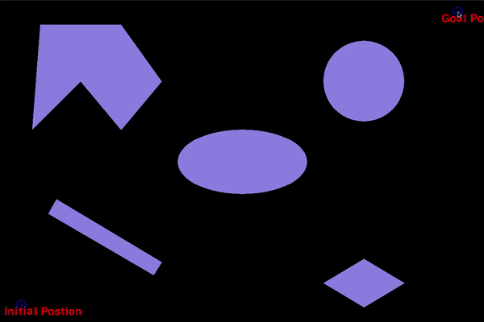

# ENPM661-ProjectTwo

# Path planning algorithm for robot.

## Overview

Path planning is a problem that every mobile robot has to solve in order to move around in its environment. 
There are multiple approaches to solve this problem, one of which is Dijkstra's algorithm. Dijktra's algorithm or also
known as shortest path first was developed by Edsger W. Dijkstra's in 1956. This algorithm iteratively goes
through all possible nodes and explores shortest path first.

Project also uses A* to solve same problem for comparision. A* is extension of Dijkstra's algorithm uses heuristics 
to increase performance. A* does not explores all possible paths, instead uses the heuristic to slowly approaches 
the goal position.

## Dependencies

- Python 3.6.9
- pygame 1.9.6

## Demo Steps

Run code Main.py for demo-

```
open terminal in project folder.
python Main.py
Enter radius and clearance
click on the pygame window to set start position and goal posiiton.
```

By default code runs for rigid robot. To compute path for point robot use argument "-p":
```
open terminal in project folder.
python Main.py -p
click on the pygame window to set start position and goal posiiton.
```

To enter start and goal position from command line use argument "-m":
```
open terminal in project folder.
python Main.py -m
Enter radius and clearance
Enter start position as "5, 5" (without qoutes)
Enter goal position as "295, 195" (without qoutes)
click on the pygame window to set start position and goal posiiton.
```
Main.py arguments

-p ,    Use point robot.

-m,     Enter Start and goal positions in command line instead of using GUI.

-a,     Use A* algorithm to solve the problem instead of Dijkstra's algorithm.

By default Main.py uses Dijkstra's algorithm's on a rigid robot and accept start and goal positions from GUI.

## Results

Point robot Dijkstra            |  Rigid robot Dijkstra  
:-------------------------:|:-------------------------:
  |   
Point robot A*|Rigid robot A* 
  |   


#### Runtime

It takes approximatly 10 seconds for Dijkstra's algorithm to find path from (5, 5) to (295, 195).

System configuration- 
- CPU: Intel Core i7-9750H @3.9 GHz x12
- RAM: 16 GB

### Limitations

Sometimes, depending on system pygame windows shows it is not responding during computing path because event.get() not being called. 
This occurred most of the time in Windows but we did not encounter it on ubuntu. Code should not take more than a minute in any situation in that case it is not responding.

## Contributors

- Toyas Dhake

- Loic Barret